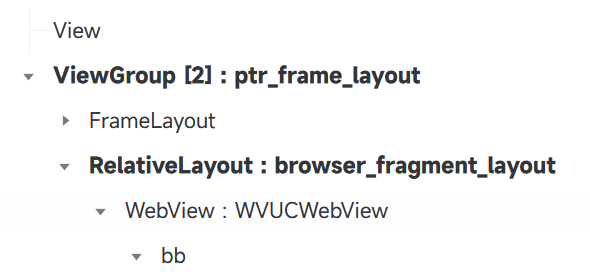
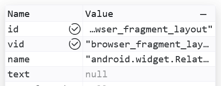
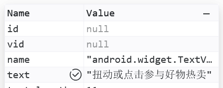
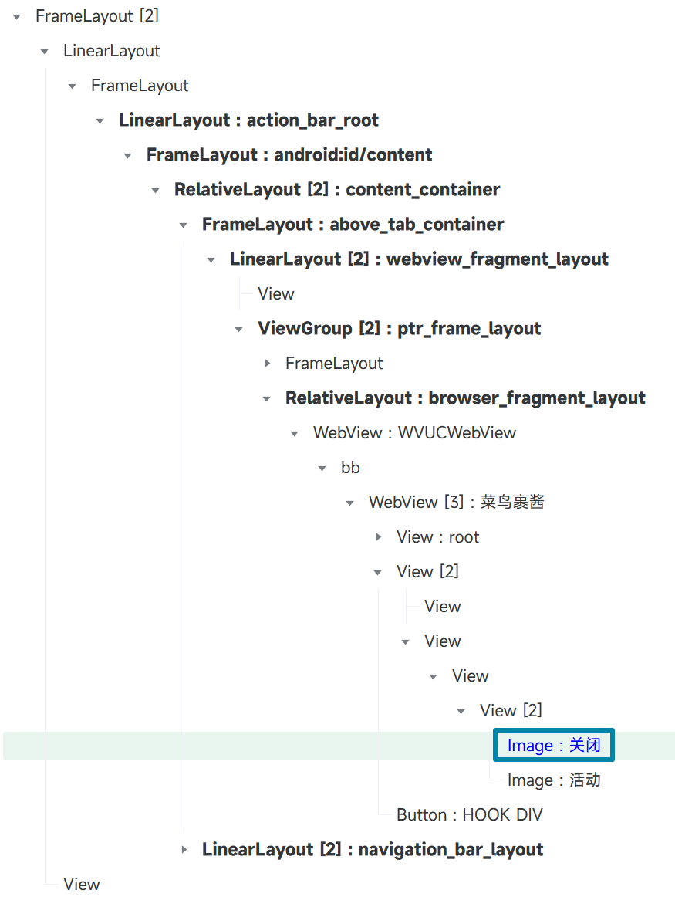
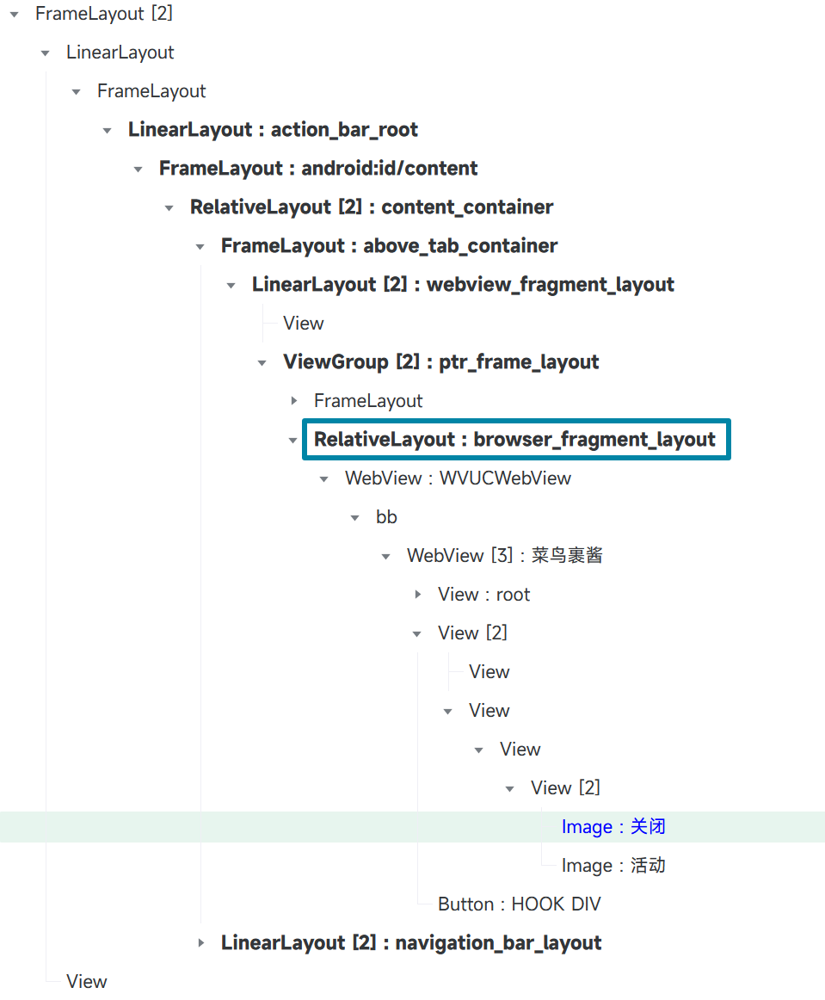
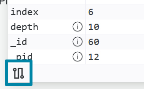

## 快速查询优化

> [!NOTE]
> 这部分内容可能不适合新手学习，但是很重要。
> 
> 在学会此内容前请务必将你的代码通过 PR 方式提交，维护者可能会对你的代码进行优化。

首先我们需要理解：**选择器是从右往左查询的**。[^1]

### 全局快速查询

在快照中，有一部分节点可以直接通过 `id` / `vid` / `name` 定位，不需要遍历就能获取。这部分节点在树形图中是加粗显示的。



选中这些节点，查看属性面板，可以快速查询的属性在名称右侧有一个勾。





由于选择器是从右往左查询的，所以满足快速查询的选择器 **末尾属性选择器** 的 **第一个属性选择表达式** 应该符合下面的结构之一：[^2]

```ts
[id='abc']
[vid='abc']
[text='abc']
[text^='abc']
[text*='abc']
[text$='abc']
```

或者使用 `||` 将它们连接形成的逻辑表达式也符合条件，即如下格式：

```ts
[id='abc' || id='abc2']
[id='abc' || vid='abc' || text='abc' || text^='abc' || text*='abc' || text$='abc']
```

下面给出实际示例：✅ 表示符合格式，❎ 表示不符合格式

```ts
A > B + C[id='x'][childCount=2] ✅
A > B + C[childCount=2][id='x'] ❎
A > B + C[id='x' || text='manbaout' || text*='ikun'][childCount=2] ✅
A > B + C[childCount=2][id='x' || text='manbaout' || text*='ikun'] ❎
```

最后，还需要对规则（推荐）或规则组设置 `fastQuery: true` 才会启用快速查询。不符合快速查询格式的规则设置此属性也不会影响查询速度。

如果节点无法快速查询，即使选择器符合快速查询格式，也不要设置 `fastQuery: true`，会查询不到。

#### 实践示例

对于快照 https://i.gkd.li/i/14033859

我们需要点击的节点如图所示：



在学习快速查询之前，我们可能会写出这样的选择器：

```ts
[text="活动"] - [text="关闭"][clickable=true]
```

注意到该节点附近有一个可以快速查询的节点，如图所示：



可以先获取 `[vid="browser_fragment_layout"]` 节点，然后查找目标节点。

优化后的选择器如下：

```ts
[text="活动"] - @[text="关闭"][clickable=true] <<3 View <2 View <2 WebView <<3 [vid="browser_fragment_layout"]
```

> [!TIP]
> 
> 点击属性面板中的 **快速复制规则按钮**，即可复制最近的可以快速查询的节点或者根节点到当前节点的表达式
> 
> 

### 局部快速查询

如果一个选择器出现了 `<<n` 并且左侧的选择器满足快速查询格式，则会使用局部快速查询。

下面给出满足局部查询优化的示例: ✅ 表示符合格式, ❎ 表示不符合格式

```ts
A > B + C[id='x'][childCount=2] <<n D ✅
A > B + C[childCount=2][id='x'] <<n D ❎
```

上面介绍的是只有一个局部选择器的情况, 下面给出多个局部快速查询的的示例

如 `A > C[id='x'] <<n D[id='y'] <<n E`, 其中的 `C[id='x'] <<n` 和 `D[id='y'] <<n` 都可以使用局部快速查询。

局部快速查询也需要在规则或规则组中设置 `fastQuery: true`。

### 避免快速查询

如果一条规则需要使用快速查询，但是其中存在 **符合快速查询格式** 却 **无法快速查询** 的选择器，例如：

```ts
A + B[id='x'] <<n C[id='y']
```

其中 C 节点可以快速查询，B 节点无法快速查询。

`B[id='x'] <<n` 会被判定为局部快速查询，但是实际上无法快速查询，所以会查询不到。

此时需要使 `B[id='x'] <<n` 不满足快速查询格式，取消局部快速查询。

例如我们可以修改为：

```ts
A + B[childCount!=null][id='x'] <<n C[id='y']
```

表达式 `childCount!=null` 始终为 true，但是 `B[childCount!=null][id='x'] <<n` 不满足快速查询格式，不会触发局部快速查询。

[^1]: https://gkd.li/guide/selector#match-order

[^2]: https://gkd.li/guide/optimize#fast-query
