# 快速入门

需要: 一台 Android 设备, 一台电脑(可选)

## 环境搭建(无电脑跳过)

本项目基于 nodejs + typescript

- 安装 [nodejs](https://nodejs.org/) 或者 [volta](https://volta.sh/)
- 安装 [pnpm](https://pnpm.io/zh/installation)
- 建议安装 [Visual Studio Code](https://code.visualstudio.com/)
- Fork 本项目, 然后 Clone 至本地, 切换到项目根目录，安装依赖 `pnpm install`

## 开始

首先我们需要给需要添加规则的APP打快照, 也就是把APP的广告截图节点信息给保存下来 <https://i.gkd.li/i/12505276> (如何获取这个链接将在审查快照这一步说明)

首先打开APP-主页-允许无障碍授权

Android>=11 的无障碍可以自己截屏, 所以如果你的设备不满足 Android>=11, 需要额外开启 高级设置-截屏服务

有 2 种常用的打快照方式：

- 悬浮窗服务
  - 在 **APP-高级设置-快照按钮** 点击弹窗授权开启**悬浮窗服务权限**后, 此时界面会出现一个**快照按钮**  , 点击这个按钮即可**截取目标应用快照**
  - 当然你也可以开启**音量快照**选项使用音量键方式来截取快照
- Web审查工具
  - 通过浏览器中连接手机上的 GKD 抓取快照, 具体使用方法在下面说明

<details close>
  <summary>Web端示例</summary>
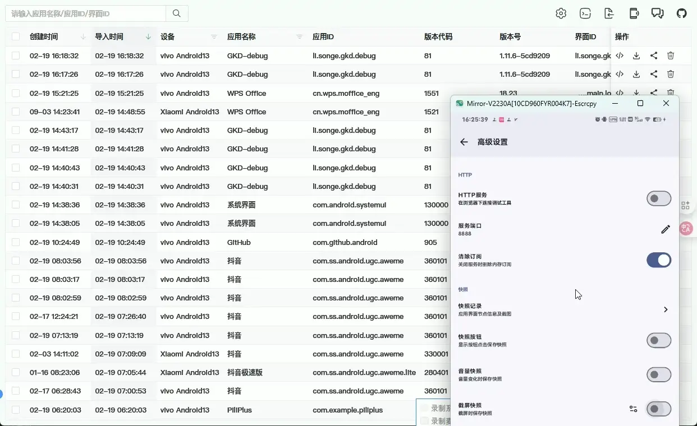
</details>

我们以 WPS 为例子, WPS 首页文档列表有一个广告, 我们先给 WPS 打一个快照, 然后使用 网页审查工具 编写测试规则订阅 关闭这个广告

打开 WPS, 然后使用上面 2 种方式之一打快照, 然后打开设置-高级设置-快照记录, 可以看到已经有了一个快照记录

<details close>
  <summary>快照记录截取示例</summary>
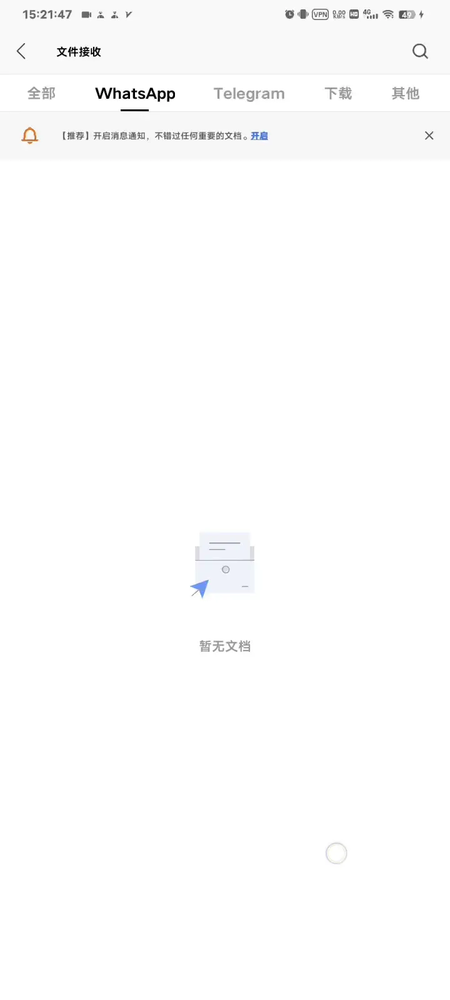
</details>

如果你没有电脑, 可以点击快照-分享，此时会分享一个 zip 文件, 截图和节点信息全在里面, 可以分享到某个云盘或者保存到本地下载（路径: /storage/emulated/0/Download/）, 然后在 [GKD_subscription/issues/new](https://github.com/Lin-arm/GKD_subscription/issues) 上传这个 zip 或者填写分享链接, 然后提出问题, 项目维护者会帮助你处理这个快照

<details close>
  <summary>分享快照示例</summary>

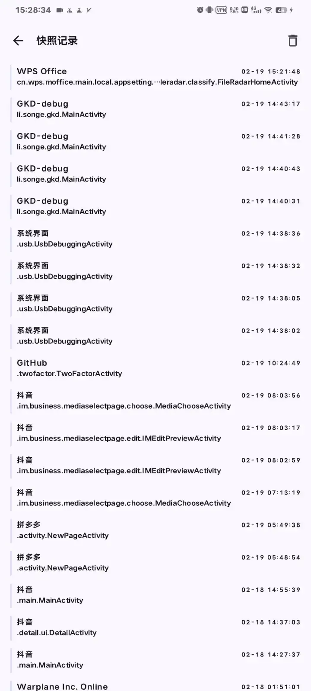

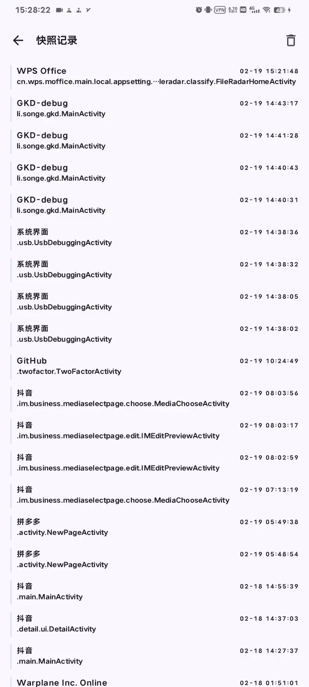

</details>

有电脑, 接下来我们将使用 网页审查工具 <https://github.com/gkd-kit/inspect>

首先让 Android 设备和电脑处于同一个局域网内，你可以选择连接同一个 WiFi, 也可以 Android 设备开热点, 然后让电脑连接这个热点，总之确保 Android 设备和电脑在同一局域网内即可。

打开 APP-设置-高级设置-HTTP服务, 此时 HTTP 服务底部出现若干条地址，一般情况下，我们只需要关注类似 `http://192.168.1.3:8888` 这样的地址即可。

> [!NOTE]
> 
> 地址不一定总是 `192.168.1.3` 这种形式, 具体情况取决于局域网内的网关设置。
>
> 如果当前局域网的网关地址被设置为 `192.168.31.1`, 那么你可能会看到类似 `http://192.168.31.3:8888` 的地址，请自行举一反三。

> [!TIP]
> 
> 你可以在**APP-高级设置-HTTP服务**下面看到你的IP访问地址

<details close>
  <summary>示例: HTTP服务</summary>

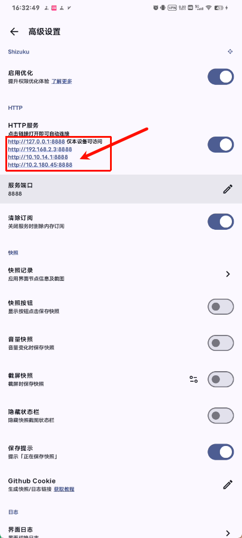

</details>

安装油猴脚本 <https://github.com/gkd-kit/network-extension>, 因为浏览器不允许 https 去连接 http 域名, 可以通过油猴脚本绕过这个限制

在浏览器访问刚才看到的 HTTP 服务地址 `http://192.168.2.3:8888`

在这个网站启用油猴脚本的注入功能

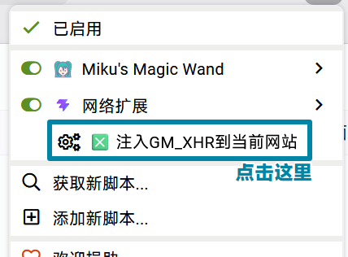

对弹出的授权点击 `临时允许` 或 `总是允许`


> [!TIP]
> 
> 不使用 `允许一次` 是因为接下来每次打开快照都会弹出授权请求
>
> 不使用 `总是允许全部域名` 是因为权限太高，有风险
>
> 每次连接的地址可能会更换，使用新地址需要重新授权

然后点击 `刷新连接` , 可以看到第一个条就是我们刚刚在 WPS 打的快照, 点击这个项目右侧的 `查看` 按钮

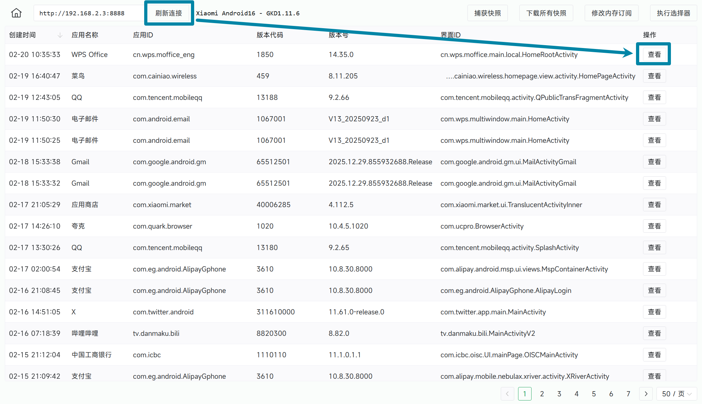

我们就能在电脑上审查 <https://i.gkd.li/i/12505286> 这个快照

## 审查快照

很明显我们只需要点击文字 `小米·广告` 右侧关闭图标即可


我们把鼠标直接放到这个图标上去, 然后点击它, 可以看到中间的节点树已经展开, 右侧也出现了属性列表

很明显这个图标按钮具有一个唯一的 id `com.mopub.ad.xiaomi:id/nativeclose`, 接下来编写一个简单的规则去点击它

那么先去了解一下这个选择器 <https://github.com/gkd-kit/selector>, 如果你写过 CSS, 应该对这个选择器很熟悉

了解完了之后, 编写的选择器也很简单 `[id="com.mopub.ad.xiaomi:id/nativeclose"]`

接下来测试这个选择器能否选中这个图标按钮, 点击审查工具的 选择器查询, 输入刚刚这个规则, 然后点击查询。

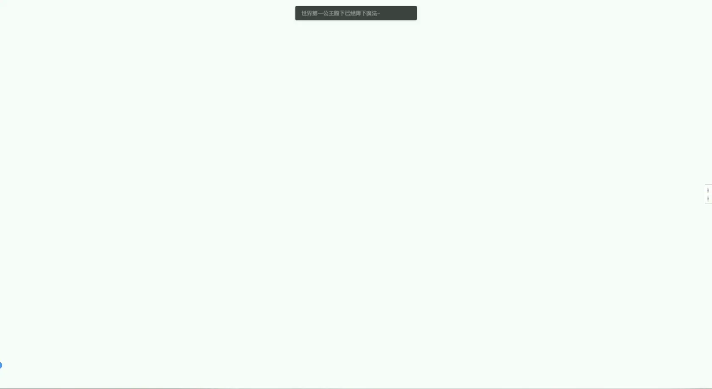

这里点击右侧的 `分享`-`复制链接-快照` 才能获取快照链接（以/i/开头）

很明显这个选择器是有效的, 那么我们去真机测试这个选择器到底行 8 行

回到刚刚的设备连接页面, 点击顶部的 `执行选择器` 按钮, 然后手机回到 WPS 界面等待出现广告

点击执行选择器确定按钮, 发现提示 `无点击目标`, 这是为什么呢, 我们对这个页面再打一个快照看看

<https://i.gkd.li/i/12505350> 鼠标移动到截图里的广告关闭按钮上去点击后查看节点树和属性面板

发现这个图标按钮的属性id已经变成了 `cn.wps.moffice_eng:id/nativeclose`, 于是我们需要扩展一下刚刚的选择器, 确保两个按钮都能选中

把这个选择器改成 `[id$="/nativeclose"]`, 这样两个节点都能选上

回到网页端设备连接界面-执行选择器-输入 `[id$="/nativeclose"]` 点击确认


可以看到点击成功了, 但是出现了另外一个弹窗了, 叫你选择关闭原因, 这时我们直接点击网页端的快照按钮得到新快照 <https://i.gkd.li/i/12505365>

点击截图里的 `关闭当前广告`, 查看属性面板, 编写测试选择器 `[text="关闭当前广告"]`, 去执行 执行选择器


那么选择器部分就基本没问题了, 接下来实时编写规则

## 编写订阅

订阅规则各个属性作用可以查看 [API 文档](https://gkd.li/api/)

打开浏览器设备连接页面-点击修改内存订阅, 输入如下内容, 然后点击确认

```text
// 订阅使用 JSON5 语法, 根节点可以是数组也可以是对象
{
  id: 'cn.wps.moffice_eng',
  name: 'WPS',
  groups: [
    {
      key: 1,
      name: '首页-文档列表广告',
      activityIds: ['cn.wps.moffice.main.StartPublicActivity', 'cn.wps.moffice.main.local.HomeRootActivity'],
      rules: [
        {
          matches: '[text="关闭当前广告"]',
          snapshotUrls: 'https://i.gkd.li/i/12505365',//获取链接的方法在上一步有说明
        },
        {
          matches: '[id$="/nativeclose"]',
          snapshotUrls: [
            'https://i.gkd.li/i/12505350',
            'https://i.gkd.li/i/12505286',
          ],
        },
      ],
    },
  ],
}
```

此时回到APP首页-订阅, 会发现多了一条**内存订阅**

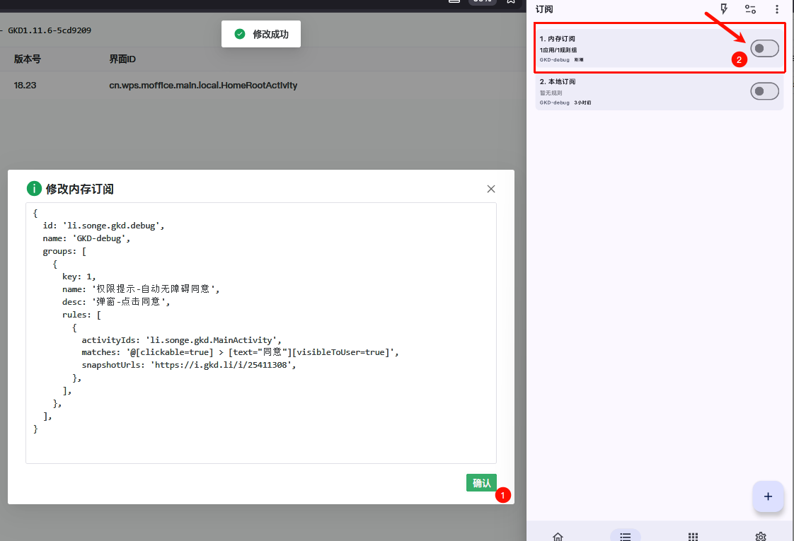

接下来把 WPS 清除全部数据后重新打开, 可以看到规则已经生效, 广告已经被自动关闭


> [!WARNING]
>
> 当你关闭 HTTP 服务器时, 默认情况下，这个内存订阅也会被清除，所以，请不要将内存订阅当作本地订阅使用。
> 如果你出于某种目的确实需要保留内存订阅中的内容，请在 APP-设置-高级设置中，关闭 `清除订阅` 功能。
> 
> 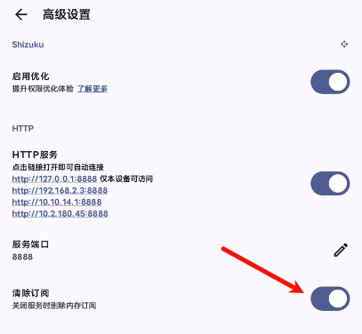

## 提交代码

如果你要添加的 APP 不存在本项目, 那么需要在 [apps](./src/apps) 目录下新建文件 `xxx.ts`, `xxx` 是 `appId` 比如 WPS 是 `cn.wps.moffice_eng.ts`

这个文件的初始内容是

```ts
import { defineGkdApp } from '@gkd-kit/define';

export default defineGkdApp({
  id: 'cn.wps.moffice_eng',
  name: 'WPS',
  groups: [],
});
```

然后在的 group 节点后添加你的规则及其快照链接, 文件内容变成

```ts
import { defineGkdApp } from '@gkd-kit/define';

export default defineGkdApp({
  id: 'cn.wps.moffice_eng',
  name: 'WPS',
  groups: [
    {
      key: 1,
      name: '首页-文档列表广告',
      exampleUrls: [
        'https://github.com/gkd-kit/subscription/assets/38517192/57787554-0443-4bc0-9f29-1759aae07b9b',
      ],
      activityIds: [
        'cn.wps.moffice.main.StartPublicActivity',
        'cn.wps.moffice.main.local.HomeRootActivity',
      ],
      rules: [
        {
          matches: '[text="关闭当前广告"]',
          snapshotUrls: 'https://i.gkd.li/i/12505365',
        },
        {
          matches: '[id$="/nativeclose"]',
          snapshotUrls: [
            'https://i.gkd.li/i/12505350',
            'https://i.gkd.li/i/12505286',
          ],
        },
      ],
    },
  ],
});
```

> [!TIP]
> 
> 可以使用 [GKD网页审查工具增强脚本](https://github.com/adproqwq/MakeGKDInspectBetter)快速高效复制出TS代码

<details close>
  <summary>示例: 快速复制规则示例</summary>

<video src="./images/quick-start/11_Fast-copy-rules.mp4" controls autoplay loop muted width="100%"></video> <!-- 兼容本地正常显示 -->

https://github.com/user-attachments/assets/4778654c-aa82-4ac7-8aa1-bd3a37040d3f

</details>

> [!IMPORTANT]
> 
> 每个规则一定要添加**快照链接**, 否则**后期维护根本不知道**这个规则到底点的是啥

<details close>
  <summary>示例: 获取快照链接示例</summary>

<video src="./images/quick-start/10_Copy-URL.mp4" controls autoplay loop muted width="100%"></video> <!-- 兼容本地正常显示 -->

https://github.com/user-attachments/assets/2e90caf2-960c-4f58-898c-b15461decc5b

</details>

然后运行校验命令 `npm run check`, 它会检测你的规则是否书写正确, 也会检测每个选择器语法是否正确

- 检查通过

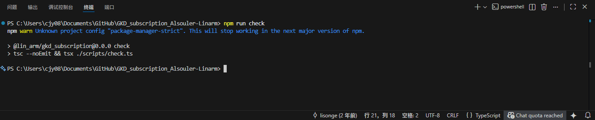 

- 检查不通过**红色波浪线指明具体错误**（示例中第19行代码''键''不对 少了个s）

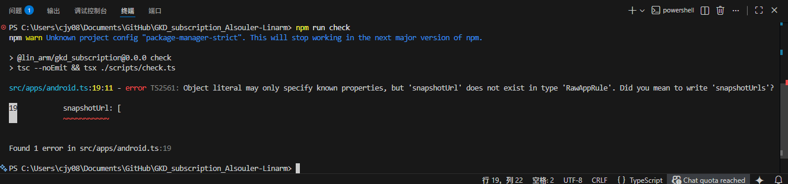

然后提交这个文件发起 pr 即可

> [!NOTE]
> 
> 通常不建议直接在 `main` 分支上修改内容进行提交，你应该针对每个要提交规则的 APP 单独创建新的分支，然后在每个 APP 的分支上分别发起各自的 pr
> 也就是说，如果你想提交 N 个 APP, 你应该分别创建 N 个分支，发起 N 个 pr

> [!TIP]
> 
> 有一些高级技巧，例如 [快速查询](./fast-query.md)，在本文不展开讲解。你可以阅读 [CONTRIBUTING.md](../CONTRIBUTING.md) 中提到的其他文档或网站了解它们。

## 检测修复代码

有些人可能没有配置 nodejs 环境或者直接在 github 网页上提交了

而提交的代码可能存在 选择器语法不正确, 文件格式(如缩进换行)不正确 等问题, 这些问题就不能被自动检测和修复

因此你需要在你 fork 后生成的新仓库启用 github actions, 操作也很简单

只需要打开你的新仓库的 Actions 页面, 然后点击下方出现的按钮即可


开启后, 当你提交并推送代码时, 它会自动帮你检测代码里的问题, 同时自动修复和提交修复后的代码
